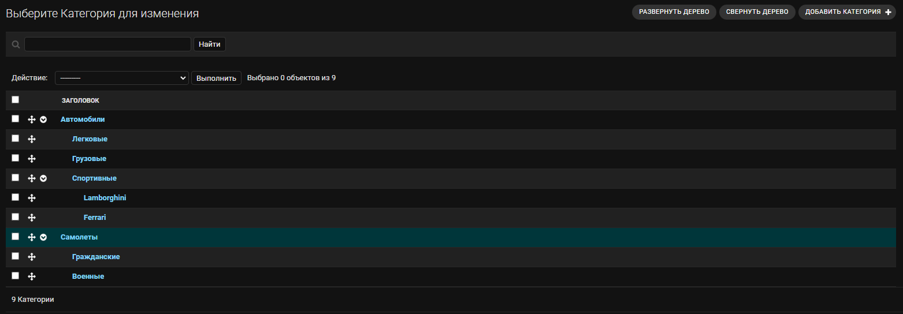
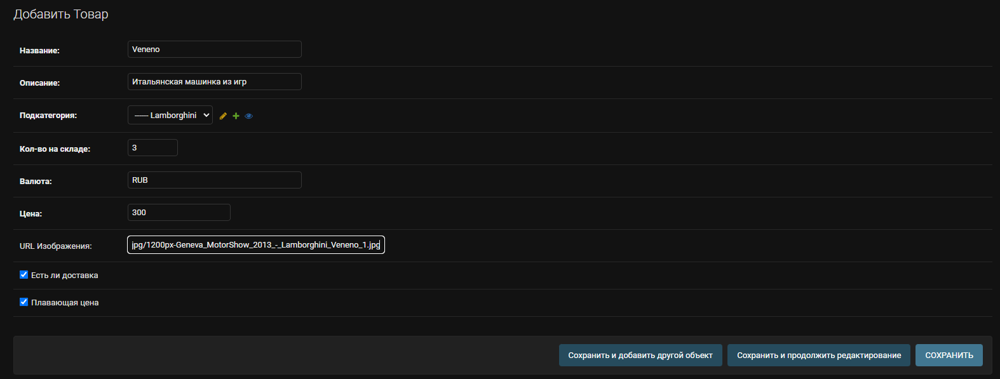
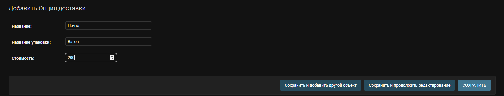
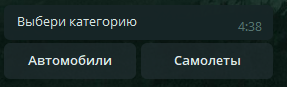
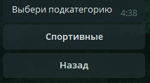
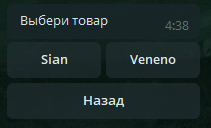
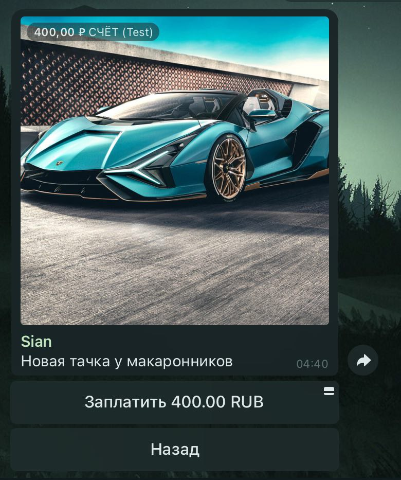
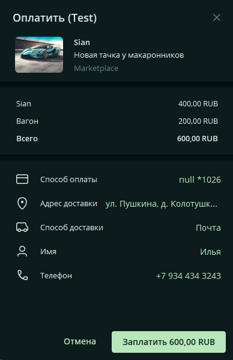
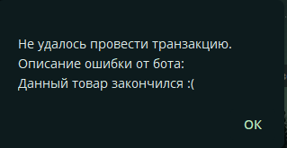

# Telegram Marketplace 🛒
## Описание 📄
Магазин в чате telegram с админкой [django](https://www.djangoproject.com/). Основан на `django-mptt` - дереве, которое помогает представлять категории и товары в определенной иерархии. Логика работы описана с использованием [telegram bot api](https://core.telegram.org/bots/api) с библиотекой [aiogram](https://github.com/aiogram/aiogram), которая позволяет разрабатывать асинхронных ботов.
## Демо 🪧
### Начнем с админки django 👨‍💻
#### Создание категории товаров 📶

#### Создание товара 🚗

#### Создание методов доставки 🚀

### Рассмотрим процесс заказа товара 🛍️
#### Выбор категории 📶

#### Выбор подкатегории 📶

#### Выбор товара 🛍️

#### Информация о товаре ℹ️

#### Процесс оплаты 💰

#### Успешная оплата ✅

#### Случай отсутствия товара на складе ❌
Если во время платежа, вдруг, не останется товара на складе, то деньги **не спишутся** и вылетит такое сообщение

## Используемые технологии 🖥️
[Django](https://www.djangoproject.com/) - веб-фреймворк для поддержки orm и создания админки

[Aiogram](https://github.com/aiogram/aiogram) - асинхронный фреймворк для работы с Telegram bot api

[Uvicorn](https://www.uvicorn.org/) - ASGI сервер для работы Django в асинхронном режиме

[Docker](https://www.docker.com/) - развертывание приложения в автономных контейнерах

[Poetry](https://python-poetry.org/) - продвинутый пакетный менеджер для Python
